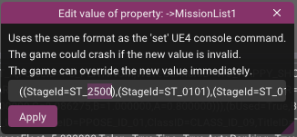
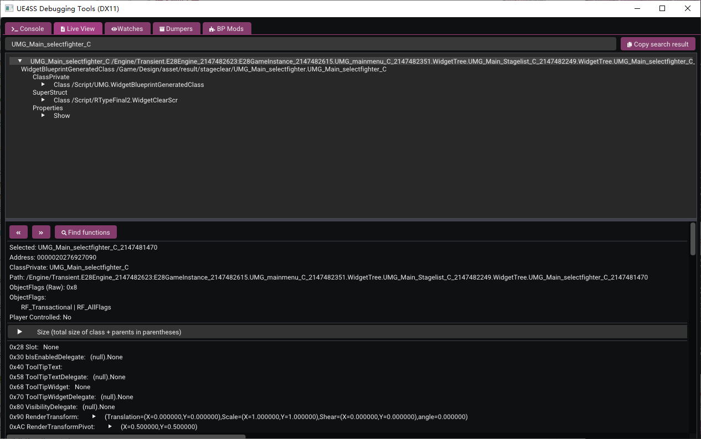

# Enter Mod Levels

Currently, *Mod-added levels* and other *unofficial levels* cannot be accessed via Arcade Mode and do not appear in Score Challenge Mode. To play these levels, you need to use UE4SS's debugging tool to modify some data.

Using *["Stage G2.0: Stonehenge in the Reverse Space"](https://github.com/BLACKujira/GradiusStage2Mod)* as an example, this guide will introduce three methods for entering modded levels.

## Prerequisites

Current level mods may come in the following forms:
- One `LUA Mod` + Two `PAK Mods`
- One `LUA Mod` + One `PAK Mod` + One `Blueprint Mod`

Regardless of the format, all parts must be installed for proper functionality. Please follow the respective guides for each mod type.

In this example, after successful installation and launching the game, you will see the following output. These three lines correspond to the successful installation of the three mod types (note that not all level mods display this output upon successful installation):

```
[xx:xx:xx] [Lua] Add ST_2500 to Enum EStageId
...
[xx:xx:xx] [Lua] [GradiusStage2] GradiusStage2 Loaded
[xx:xx:xx] [Lua] [GradiusStage2] Definition of Stage G2.0 in StageList detected
```


Additionally, you need to know the level's *ID* or *Enum Name*, which is typically provided by the mod author. In this example, the level's ID is `100`, and the Enum Name is `ST_2500`.

After launching the game, navigate to the *UE4SS* debugging tool and click the `Live View` tab to access the following page:


The following operations differ based on the chosen method.

## Method 1: Entering Through a Custom Route

Ensure that you have **reached the title screen at a minimum**; do not perform this operation before the game save has been loaded.

In the *Live View* search box, search for `PlayerSettings`. Locate the `PlayerSettings_2147482553` object (the number may vary; right-click the search box and enable `Instance only` to find it more easily), then click it. You will see the following page:


Expand `CourseEditInfo`, right-click `MissionList1`, and select `Edit value`:


In the lower part of the window, change the value after the first `StageId=` to `ST_2500` or `100`, then click `Apply`. This operation edits a custom route, allowing you to select special levels.



If successful, the first entry after `MissionList1` will change to `ST_2500`. If `StageId=` appears empty, check whether the input is correct and ensure that the `LUA Mod` part of the level mod is correctly installed.

Next, go to *Score Challenge* and select *Play Custom Route*. You will notice that the first level of the first route is now `Stage G2.0`. Select this route to play the new level.


You can also edit other routes or levels. The advantage of this method is that the edited level data will be saved with the game progress, so there's no need to edit it each time. However, the game will always start without equipment.

## Method 2: Entering via the Fighter Selection Screen

In *Score Challenge*, select any level and proceed to the *Fighter Selection Screen*. Switch to the *UE4SS* debugging tool, and in the *Live View* search box, search for `UMG_Main_selectfighter_C` (be sure to include the space at the end; otherwise, many subcomponents will appear, making it difficult to locate the correct one). Select the `UMG_Main_selectfighter_C_2147481470` object (the number may vary).



Scroll down in the lower part of the window to find the `0x470 StageId` property. Right-click the value `ST_XXXX` and choose `Edit value`.


Change the value in the popup window to `ST_2500` or `100`, then click `Apply`. If successful, the `0x470 StageId` value will change to `ST_0100`. This is a display error—the value always shows the next ID, and since there's no level after `ST_2500`, it defaults to this value. If you right-click to edit the value again, you'll see that the input value remains correct.

Return to the game; the *Fighter Selection Screen* will appear unchanged, which is normal since internal ID changes do not trigger display updates. Select your fighter and confirm to play the new level.

If the game stutters, clear the *Live View* search box and press Enter. Otherwise, every in-game object change will trigger a search, consuming significant performance.

The advantage of this method is that you can challenge levels with full equipment, but you need to set it again each time you want to enter the level.

## Method 3: Entering by Modifying the Starting Level of a Course

Similar to the previous methods, search for `ConfigGame` in the *Live View* search box (**do not use `Instance only`**). Locate the `Default__ConfigGame` object and find and expand `0x120 GameNormal` in the lower part of the window. Right-click the value of `StageId` and select `Edit value`.


Change the popup window's value to `ST_2500` or `100`, then click `Apply`. Like Method 2, this value may display incorrectly as `ST_0100`, which is normal.

Enter Arcade Mode, select your fighter, and enter the main course. You will find that the first level has become the one you just set.

This method does not offer any particular advantage over the previous ones and should be used as a backup option.

## Additional Reading: What Do the Different Parts of a Level Mod Do?

To understand the purpose of the various parts of a level mod, it's essential to know how the game loads levels. When loading a level, the game first determines the level ID, then finds the level in the stage list, and finally retrieves the specific information and corresponding map.

Therefore, adding a level requires not only adding the corresponding map and enemies but also expanding the existing level ID and stage list. This is where the three parts of the `Level Mod` come in:

- `LUA Mod` registers new level IDs when the game starts.
- `PAK Mod` replaces the original stage list with a new list containing the additional levels.
- Another `PAK Mod` or `Blueprint Mod` contains the main level content.

This is the current configuration method. If level IDs could be registered within the `Blueprint Mod`, the `LUA Mod` could be omitted. Additionally, if data tables were restored in Unreal Engine, the `PAK Mod` used to replace the stage list could be merged with the main `.pak` file. Therefore, more optimized `Level Mod` configurations may appear in the future.

Currently, the method involves replacing the *original stage list* with one that *includes the new levels*, which prevents multiple `Level Mods` from being installed simultaneously. One mod's stage list will overwrite the other's. This also means that new official levels added through game updates won't display or load if a `Level Mod` is present. To resolve this, remove the `Level Mod`.

## Additional Reading: What Is the Purpose of Gates?

You may have noticed that `StageId` always appears alongside `GateNo`. In fact, `GateNo` refers to the checkpoint number within the game, determining the scroll position when entering the level.

Typically, `0` represents the spawn point when directly entering the level, `10` represents the checkpoint when dying at the beginning of the level, and `20`, `30`, `40`, etc., follow sequentially.

In Methods 2 and 3, `GateNo` can also be specified, allowing convenient practice for later parts of the level and boss battles.
