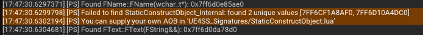
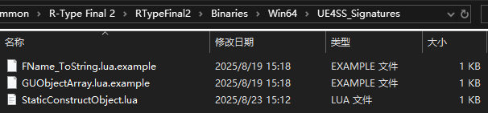

# Installing AOB Script

After the *R-Type Final 2* `v2.0.4` update, *UE4SS* encountered an issue where it could not find the `StaticConstructObject` AOB signature.  
This tutorial explains how to add an AOB script to *UE4SS* after [installing UE4SS](InstallingUE4SS).

## Determine if You Need an AOB Script

If, when launching the game with *UE4SS* installed, the console output shows multiple lines like:

```
[PS] Failed to find GNatives: expected at least one value
[PS] You can supply your own AOB in 'UE4SS_Signatures/GNatives.lua'
```

or

```
[PS] Failed to find StaticConstructObject_Internal: found 2 unique values
[PS] You can supply your own AOB in 'UE4SS_Signatures/StaticConstructObject.lua'
```

and mods cannot be loaded, then you need to install an AOB script.



## Download the AOB Script

Go to the [RTF2-UE4SS-AOB](https://github.com/BLACKujira/RTF2-UE4SS-AOB) repository, and on the right side under the [Releases](https://github.com/BLACKujira/RTF2-UE4SS-AOB/releases) page, download all `.lua` files for the corresponding game version.

In theory, this script should work with different versions of *UE4SS*. It has already been tested on both the official and experimental releases of *UE4SS* `v3.0.1`.

## Install the AOB Script

Similar to installing UE4SS, first open the game installation directory.  
Then navigate to the `RTypeFinal2` folder, and inside it open the `Binaries`, `Win64`, and `UE4SS_Signatures` folders in order.  
Here, you should see two files: `FName_ToString.lua.example` and `GUObjectArray.lua.example`.

Place the downloaded `.lua` files into this folder. **Do not rename the `.lua` files.**



## Verify the Installation

### 1. Installed Successfully or Script Bug

If the output looks like the following and the game does not crash, the installation was successful:

```
StaticConstructObject_Internal address: 0x7ff6d10a4dc0 <- Lua Script
```

If the game crashes, it means the AOB script pointed to the wrong location. Remove the script and contact the script developer.

### 2. Version Mismatch or Script Bug

If the output looks like this, it means there is a version mismatch.  
Check whether the script matches the correct game version.

It could also mean the AOB chosen by the script itself is problematic. In this case, contact the script developer.


```
AOB scans could not be completed because of the following reasons:
Was unable to find AOB for 'StaticConstructObject' via Lua script
```

### 3. Installation Failed

If the output still shows something like:


```
[PS] Failed to find GNatives: expected at least one value
```

or

```
[PS] Failed to find StaticConstructObject_Internal: found 2 unique values [7FF6CF1A8AF0, 7FF6D10A4DC0]`
```


it means the script did not load. Check whether the script was placed in the correct folder and that the file name is correct.

In the *UE4SS* `v3.0.1` experimental version, two optional functions `GNatives` and `ConsoleManagerSingleton` also cannot be located using built-in methods, and will output similar messages. However, UE4SS can still launch normally, and mods should work fine for now.

# DIY Script

If you want to write your own AOB script, you can refer to this tutorial: [Writing AOB Scripts](../../EX_ModInfrastructure/en/WritingAOBScripts.md.md)