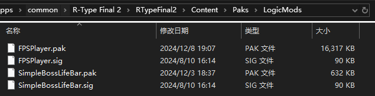

# Installing Blueprint Mods

## What is a Blueprint Mod?
A `Blueprint Mod` is a special type of `PAK Mod`. Like PAK Mods, Blueprint Mods are files ending with `.pak`, but they require a mod loader like UE4SS to function properly. The installation process for Blueprint Mods differs slightly from PAK Mods. Refer to the mod author's information to determine the type of mod.

Typically, `PAK Mod` filenames end with `_P`, whereas `Blueprint Mods` do not.

## Locating the Installation Directory for Blueprint Mods
As with installing UE4SS, first navigate to the game's installation directory. Open the `RTypeFinal2` folder, followed by the `Content` folder, and then the `Paks` folder. Here, you'll see many `.pak` and `.sig` files paired together.


If you’ve run the game at least once after successfully installing UE4SS, a `LogicMods` folder should appear in the `Paks` directory. This is where Blueprint Mods should be installed.

- If the `LogicMods` folder does not appear even after successfully running the game with UE4SS installed, create the `LogicMods` folder manually.

## Installing Blueprint Mods
Copy the Blueprint Mod's **`.pak` file** into the `LogicMods` folder. If there is a corresponding `.sig` file, copy it as well.

If there is no `.sig` file, you can **copy** any `.sig` file from the `Paks` folder, paste it into the `LogicMods` folder, and rename it to match the `.pak` file name of the Blueprint Mod.

- Unlike PAK Mods, **do not rename the Blueprint Mod's .pak file** unless the mod author specifically requests it. Otherwise, the Blueprint Mod will not function properly.



### Example: Installing SimpleBossLifeBarMod
1. Download the `SimpleBossLifeBar.pak` file from the [SimpleBossLifeBarMod](https://github.com/BLACKujira/SimpleBossLifeBarMod) [Releases](https://github.com/BLACKujira/SimpleBossLifeBarMod/releases) page.
2. Copy `SimpleBossLifeBar.pak` to the `LogicMods` folder.
3. Copy the `pakchunk0-WindowsNoEditor.sig` file from the `Paks` folder to the `LogicMods` folder and rename it to `SimpleBossLifeBar.sig`.
4. Run the game. If the installation is successful, the UE4SS console will display output like this:
    ```
    [xx:xx:xx] [Lua] [SimpleBossLifeBar] ModActorPath: /Game/Level/title/title.title:PersistentLevel.ModActor_C_2147482405
    [xx:xx:xx] [Lua] [SimpleBossLifeBar] WE ARE NOW RUSHING INTO STAGE 0 BE ON YOUR GUARD!
    ```

## Additional Information: What is a .pak File?
A `.pak` file is a resource file used by the Unreal Engine, containing game assets such as textures, materials, music, and maps.

The Unreal Engine allows `.pak` files to patch content from other `.pak` files, enabling content overrides. `PAK Mods` leverage this feature to modify game content, such as visuals, sounds, and data. However, PAK Mods are typically static and cannot add new game content.

In contrast, `Blueprint Mods` include a special entry object in their `.pak` files. With a mod loader like UE4SS, this entry object can be added to the game level, enabling game content expansion.

The UE4SS Blueprint Mod system relies on the .pak file name to locate the entry object within the same-named path inside the .pak file. This is why the Blueprint Mod's .pak file should not be renamed.

## Additional Information: What is a .sig File?
A `.sig` file is a signature file for a `.pak` file. When loading `.pak` files, the game checks for the presence of corresponding `.sig` files. If the `.sig` file is missing, the `.pak` file will not load. This is why `.pak` files and `.sig` files in the `Paks` folder appear in pairs.

For mods, corresponding `.sig` files are also required. Fortunately, the game does not perform detailed validation of `.sig` files. Mod developers can simply copy a `.sig` file from the game, rename it to match the mod's `.pak` file, and bypass the check.
