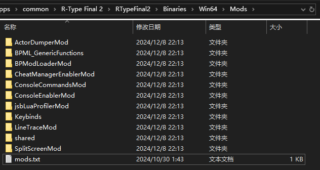

# Installing LUA Mods

## What is a LUA Mod?
A `LUA Mod` is usually distributed as a compressed file. When you extract the archive, you'll find a folder named after the Mod. Inside this folder, there must be a `Scripts` folder, and within that folder, there should be a `main.lua` file.

## Locating the Installation Directory for LUA Mods
Similar to installing UE4SS, start by opening the game's installation directory. Then, navigate to the `RTypeFinal2\Binaries\Win64` folder where UE4SS is installed. Within this folder, you should find a `Mods` folder, which is the installation location for LUA Mods.

Open the `Mods` folder, where you should see several pre-installed `LUA Mods` and a `mods.txt` file.



## Installing LUA Mods
Extract the `LUA Mod` archive, and copy the `folder named after the Mod` into the `Mods` folder.

Open the `mods.txt` file. You will see a list of Mod names.

Add a new entry below the Mod list and above the line `; Built-in keybinds, do not move up!` in the format `(ModName) : 1`
- Replace `(ModName)` with the exact name of the Mod's folder, which should match the folder name you copied.


### Example: RTF2DebugToolsMod
1. Download the `RTF2DebugTools.zip` file from the [RTF2DebugToolsMod](https://github.com/BLACKujira/RTF2DebugToolsMod) [Releases](https://github.com/BLACKujira/RTF2DebugToolsMod/releases) page.
2. Extract `RTF2DebugTools.zip` and copy the `RTF2DebugTools` folder into the `Mods` folder.
3. Open the `mods.txt` file, and add the following line below the Mod list and above `; Built-in keybinds, do not move up!`:  
   `RTF2DebugTools : 1`
4. If the installation is successful, you will see output similar to the following in the UE4SS console when launching the game:
```
[xx:xx:xx] Starting Lua mod 'RTF2DebugTools'
[xx:xx:xx] [Lua] RTF2 Debug Tools loaded
```