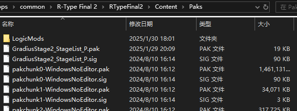

# Installing PAK Mod

## What is a PAK Mod?
A `PAK Mod` is a superset of the `Blueprint Mod`, characterized by files ending with `.pak`. These mods are commonly used for modifying values, replacing textures, and changing music without needing a mod loader.

Usually, `PAK Mod` file names end with `_P`, while `Blueprint Mods` do not.

## Locating the Installation Directory for PAK Mod
Similar to `Blueprint Mods`, start by opening the game's installation directory. Navigate to the `RTypeFinal2` folder, then proceed to the `Content` folder and finally the `Paks` folder. Here, you will find pairs of `.pak` and `.sig` files.

This is where you place your `PAK Mod` files.

## Installing a PAK Mod
Copy the `.pak` file of the `PAK Mod` into the `Paks` folder. If there is a corresponding `.sig` file, copy it as well.

If no `.sig` file is provided, copy any existing `.sig` file from the `Paks` folder and rename it to match the name of the `.pak` file.

- Unlike `Blueprint Mods`, renaming `.pak` files may not affect their functionality, but it's best not to do so. **Do not remove the `_P` suffix** from the filename.

## Example: Mod for Replacing the Title Screen Music
1. Download the `TitleBGM_Final_P.pak` file from the [RTypeFinal2MusicMod](https://github.com/BLACKujira/RTypeFinal2MusicMod) [Releases](https://github.com/BLACKujira/RTypeFinal2MusicMod/releases) page.
2. Copy `TitleBGM_Final_P.pak` into the `Paks` folder.
3. Copy an existing `pakchunk0-WindowsNoEditor.sig` from the `Paks` folder and rename it to `TitleBGM_Final_P.sig`.
4. Launch the game. If the installation was successful, the title screen background music will have changed.

## Extended Reading: Resource Overwrite Rules in PAK Files
When two different `.pak` files contain resources with identical locations and names, the game decides which version to use based on the `.pak` file name (the specific rule is unclear). Notably, files ending with `_P` have the highest priority, which is why most `PAK Mods` have this suffix. Removing `_P` might cause the mod to stop working.

This feature seems to be intended for game patches but provides an easy way for mod developers to replace game resources.

If two mods (`PAK Mod` or `Blueprint Mod`) contain identical resources, resource conflicts may occur, potentially causing one or both mods to malfunction. This is more likely with similar types of mods.

## Extended Reading: How to Verify if a PAK Mod was Successfully Installed
Since `PAK Mods` cannot actively run custom logic, they cannot output installation success messages like `Blueprint Mods` and `LUA Mods`. You can only verify a successful installation by observing changes in the game.

If you know the content of the `.pak` file, you can use *UE4SS*'s debug window to check corresponding resources to verify installation.

Sometimes, mod authors release diagnostic `Blueprint Mods` or `LUA Mods` to actively detect and display installation status. In other cases, they may replace easily noticeable content, such as stage images in score challenges, to indicate successful installation.
