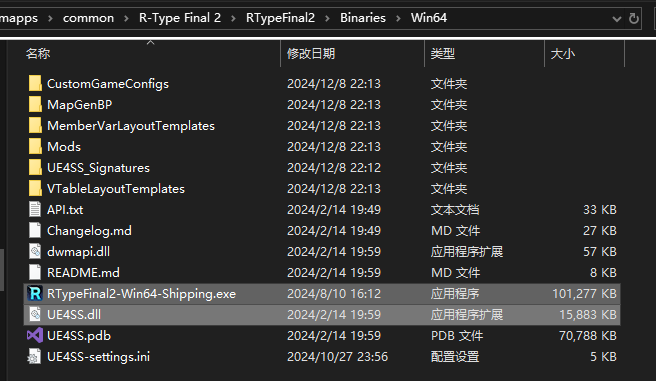
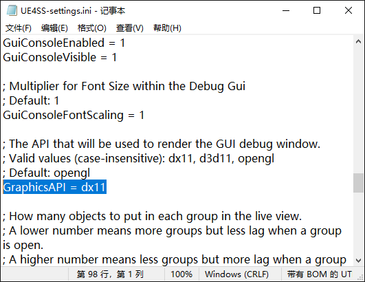

# Installing UE4SS
Before developing or using mods for *R-Type Final 2*, installing UE4SS is an essential first step.

`UE4SS` is a powerful tool that provides support for two main types of mods—`LUA Mods` and `Blueprint Mods`. It also includes features like viewing and editing in-game objects, exporting map files, and generating header files. Most of the following content relies on UE4SS as a foundation.

In this tutorial, we will learn how to install the developer version of `UE4SS v3.0.0`, upgrade it to `v3.0.1`, verify the installation, and troubleshoot potential issues.

**Note: After the *R-Type Final 2* `v2.0.4` update, *UE4SS* encountered an issue where it could not find the `StaticConstructObject` AOB signature. Be sure to follow [this guide](InstallingAOBScript.md) to install the AOB script for *UE4SS* after installation.**
## Downloading UE4SS
First, visit the [UE4SS-RE/RE-UE4SS](https://github.com/UE4SS-RE/RE-UE4SS) repository. Click on the [Releases](https://github.com/UE4SS-RE/RE-UE4SS/releases) section on the right side of the page and download `zDEV-UE4SS_v3.0.1.zip`. Scroll down and also download `zDEV-UE4SS_v3.0.0.zip`.

Note: Both versions need to be downloaded because `v3.0.0` must be installed before upgrading to `v3.0.1`.

## Locating the Installation Directory
For the Steam version, right-click the game icon, select `Manage` -> `Browse Local Files` from the menu. This will open the game’s installation directory. You should see an executable named `RTypeFinal2.exe` and folders like `Engine` and `RTypeFinal2`. If you purchased the OST, there will also be an OST folder.

Open the `RTypeFinal2` **folder**, then navigate to the `Binaries` folder, and finally to the `Win64` folder. Here, you should see a file named `RTypeFinal2-Win64-Shipping.exe`. This is the installation directory for UE4SS.

## Installing UE4SS v3.0.0
Extract all the contents of `zDEV-UE4SS_v3.0.0.zip` into the installation directory. If done correctly, the folder should look like the image below.

Now, launch the game. If the installation was successful, you should see the UE4SS console launch alongside the game. If not, double-check the steps above. If everything seems correct and it still doesn’t work, please refer to the [Manual Injection of UE4SS](ManualInjectionUE4SS.md) guide for a solution.

If the console appears blank, don't worry. This issue can be resolved after upgrading to `v3.0.1`.

## Upgrading to UE4SS v3.0.1
Extract the contents of `zDEV-UE4SS_v3.0.1.zip` into the same directory, overwriting any files with the same name. This upgrades UE4SS to version `v3.0.1`.

## Resolving Console Display Issues
If the UE4SS console is entirely black or white, locate the `UE4SS-settings.ini` file in the UE4SS installation directory.

Open the file with any text editor. Find the line `GraphicsAPI = opengl` and change it to `GraphicsAPI = dx11`.

## Additional Installation Guides
You can refer to the [official UE4SS installation guide](https://docs.ue4ss.com/dev/installation-guide.html) for information that may be missing from this guide.

Since *R-Type Final 2* is a typical game developed using UE4, the installation of UE4SS follows the same process as for other UE4 and UE5 games. Most online tutorials and videos can be used as references.

## What’s Next...
**After the `v2.0.4` update, an *AOB script* must be added to *UE4SS* in order for it to work properly. Please refer to the following tutorial for instructions:**
[Installing AOB Script](InstallingAOBScript.md)

Then, you can start installing mods. The installation method varies depending on the type of mod. Refer to the following tutorials to install different types of mods:
- [Installing Blueprint Mods](InstallingBlueprintMods.md)
- [Installing PAK Mods](InstallingPAKMods.md)
- [Installing LUA Mods](InstallingLUAMods.md)

Some mods may require the installation of both `LUA Mods` and `Blueprint Mods` components to work correctly.

## Additional Reading: Why Use the Developer Version of the Latest UE4SS
The developer version has the console enabled by default, making it easier for beginners to verify whether UE4SS is functioning correctly without modifying configuration files. The console also outputs information useful for determining if a mod is properly installed.

Additionally, since weapon, unit, and level data are stored in data tables in the game, adding these elements with multiple mods requires runtime additions to the data tables to avoid conflicts rather than overwriting the original data.

Although this feature is not yet available in the current version of UE4SS, it may be introduced in a future release. To prepare for future upgrades, it’s recommended to use the latest version (`v3.0.1`) for mod development and loading.