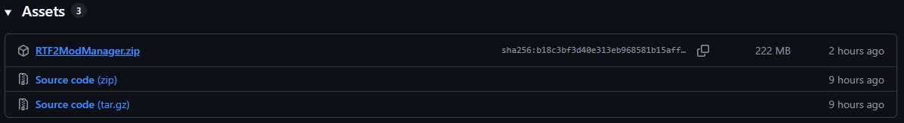
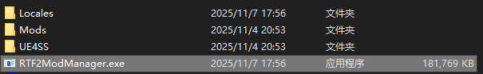
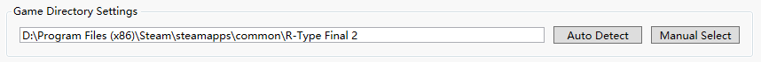
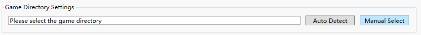
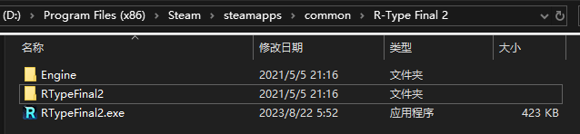
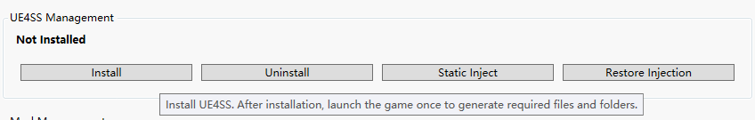
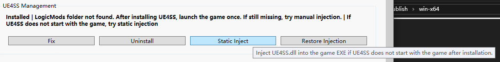
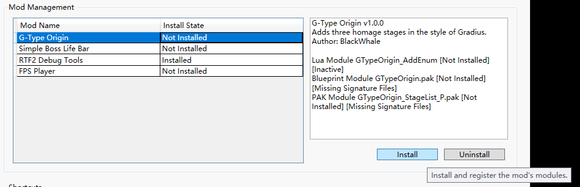

# Using the Mod Manager

To simplify the complex installation process of UE4SS and various mods, I created the [R-Type Final 2 Mod Manager](https://github.com/BLACKujira/RTF2ModManager).  
This is a graphical management tool designed to streamline the *R-Type Final 2* mod installation process. It supports multi-language switching, automatic game directory detection, UE4SS installation, and one-click management of common mods.

## Downloading the Mod Manager

First, download `RTF2ModManager.zip` from the [RTF2ModManager Releases page](https://github.com/BLACKujira/RTF2ModManager/releases).

Extract all contents of the zip file to any directory.

Run `RTF2ModManager.exe` from the extracted folder.

> **Do not run `RTF2ModManager.exe` directly from inside the zip file**, as this may cause errors due to missing mod files.

## Setting the Game Directory

If you are using *Steam* and haven’t changed the default installation path  
(`\Program Files (x86)\Steam\steamapps\common\R-Type Final 2`), the program will automatically detect your game directory upon startup.  
In this case, the `Game Directory` section will display the detected path.

Otherwise, if the `Game Directory` section shows `Please select game directory`, click the `Manual Select` button next to it.

In the window that appears, select the folder where `RTypeFinal2.exe` is located.  
This folder should also contain subfolders such as `Engine` and `RTypeFinal2`.  
If you purchased the OST, you’ll also see an OST folder here.

## Installing UE4SS

The `UE4SS Management` section shows the current installation status of *UE4SS*.  
Most mods require *UE4SS* to function. Click the `Install` button in this section to install *UE4SS* (includes an *AOB script* compatible with version `v2.0.4`).

After the first installation, **start the game once** to generate the necessary files and folders.  
If the installation is successful, you will see the *UE4SS Console* and a command-line window open alongside the game window.  
When you return to the Mod Manager, the message under `UE4SS Management` saying  
`LogicMods folder not found. After installing UE4SS, launch the game once. If still missing, try manual injection.`  
will disappear, indicating that mods can now be installed.

### Using Static Injection

If, after installing *UE4SS*, neither the *UE4SS Console* nor the command-line window appears when you launch the game,  
it means that `UE4SS.dll` is not automatically injected into the game process in your system environment.  
You may need to use `Static Injection` to force the injection.

Click `Static Injection` and wait a few moments. Once it completes, try launching the game again to generate the required files and folders.

## Installing Mods

In the `Mod Management` section, the left-hand list displays supported mods and their installation statuses.  
Selecting a mod from the list will show its detailed information on the right.  
Click the `Install` button below to install the selected mod.  
The program will automatically install all necessary components and handle dependencies.

If you see messages such as  
`UE4SS is not installed — mods containing non-PAK modules cannot be installed.` or  
`The LogicMods folder was not detected. Cannot install Mods that contain blueprint modules.`,  
please ensure *UE4SS* is properly installed and that you have launched the game at least once.

> This program currently only supports installing the following mods:  [G-Type Origin](https://github.com/BLACKujira/GTypeOrigin),  [Simple Boss LifeBar](https://github.com/BLACKujira/SimpleBossLifeBarMod),  [RTF2 Debug Tools](https://github.com/BLACKujira/RTF2DebugToolsMod), and  [FPS Player](https://github.com/BLACKujira/FPSPlayerMod).  
> Other mods must still be installed manually.

## Backing Up Save Files

If you want to restore your save data after trying mods, or if you’re concerned about potential save corruption,  
you can back up your save files beforehand and restore them later if necessary.

In the `Quick Functions` section at the bottom of the program, click `Open Save Folder`.  
The manager will usually locate and open your save directory automatically.

**Copy** the files in that folder (especially `SLOT00.sav`, the main save file) to another location for safekeeping.
