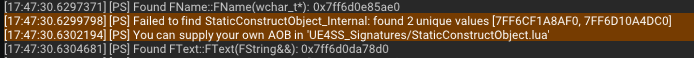
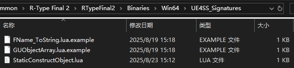

# AOBスクリプトのインストール
*R-Type Final 2* の `v2.0.4` アップデート以降、*UE4SS* が `StaticConstructObject` の AOB シグネチャを検出できなくなる問題が発生しています。本チュートリアルでは、[UE4SSのインストール](UE4SSのインストール.md) 後に AOB スクリプトを追加する方法を紹介します。

## AOBスクリプトが必要かどうかの確認

*UE4SS* をインストールしたゲームを起動した際に、コンソール出力に以下のような複数のエラーメッセージが表示され、Modが動作しない場合は AOB スクリプトのインストールが必要です。

```
[PS] Failed to find GNatives: expected at least one value
[PS] You can supply your own AOB in 'UE4SS_Signatures/GNatives.lua'
```

または

```
[PS] Failed to find StaticConstructObject_Internal: found 2 unique values
[PS] You can supply your own AOB in 'UE4SS_Signatures/StaticConstructObject.lua'
```

のようなメッセージが出ます。



## AOBスクリプトのダウンロード

[RTF2-UE4SS-AOB](https://github.com/BLACKujira/RTF2-UE4SS-AOB) リポジトリにアクセスし、右側にある [Releases](https://github.com/BLACKujira/RTF2-UE4SS-AOB/releases) ページから、該当バージョンに対応する `.lua` ファイルをすべてダウンロードしてください。

理論的には、このスクリプトは異なるバージョンの *UE4SS* でも使用できるはずです。すでに *UE4SS* `v3.0.1` の正式版および実験版でテスト済みです。

## AOBスクリプトのインストール

UE4SS をインストールした時と同じく、まずゲームのインストールディレクトリを開きます。次に `RTypeFinal2` フォルダを開き、その中の `Binaries` → `Win64` → `UE4SS_Signatures` フォルダへ進みます。ここには `FName_ToString.lua.example` と `GUObjectArray.lua.example` の 2 つのファイルがあるはずです。

ダウンロードした `.lua` ファイルをこのフォルダに配置してください。`.lua` ファイルのリネームはしないでください。



## インストールの確認

### 1. インストール成功 または スクリプトのバグ

以下のような出力があり、ゲームがクラッシュしなければインストール成功です。

```
StaticConstructObject_Internal address: 0x7ff6d10a4dc0 <- Lua Script
```

ゲームがクラッシュする場合は、AOBスクリプトが誤ったアドレスを指している可能性があります。スクリプトを削除して開発者に連絡してください。

### 2. バージョン不一致 または スクリプトのバグ

以下のような出力がある場合、ゲームのバージョンとスクリプトのバージョンが一致していません。スクリプトとゲームのバージョンを確認してください。

また、スクリプト自体の AOB の選定に問題がある可能性もあります。その場合は開発者に連絡してください。

```
AOB scans could not be completed because of the following reasons:
Was unable to find AOB for 'StaticConstructObject' via Lua script
```

### 3. インストール失敗

依然として以下のような出力が表示される場合、

```
[PS] Failed to find GNatives: expected at least one value
```

または

```
[PS] Failed to find StaticConstructObject_Internal: found 2 unique values [7FF6CF1A8AF0, 7FF6D10A4DC0]`
```

スクリプトが読み込まれていません。正しいフォルダに配置したか、ファイル名が正しいか確認してください。

*UE4SS* `v3.0.1` の実験版では、`GNatives` と `ConsoleManagerSingleton` の 2 つの関数も内蔵方法で特定できず、同様のエラーメッセージが出力されます。ただし、この場合でも UE4SS は正常に起動し、Modの利用には支障ありません。

# DIYスクリプト

自分で AOB スクリプトを作成したい場合は、こちらのチュートリアルを参考にしてください： [AOBスクリプトの作成](../../EX_ModInfrastructure/ja/AOBスクリプトの作成.md) 