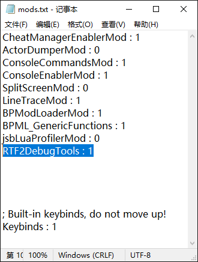

# LUA Modのインストール

## どのようなModがLUA Modか
`LUA Mod` は通常、圧縮ファイルとして提供されます。圧縮ファイルを開くと、Modの名前と同じ名前のフォルダが表示されます。このフォルダの中には必ず `Scripts` フォルダがあり、`Scripts` フォルダの中には必ず `main.lua` ファイルがあります。

## LUA Modのインストール場所を特定する
UE4SSをインストールする際と同じように、まずゲームのインストールディレクトリを開きます。次に、UE4SSがインストールされた `RTypeFinal2\Binaries\Win64` フォルダに移動します。このフォルダには `Mods` フォルダがあるはずです。このフォルダがLUA Modのインストール場所です。

`Mods` フォルダを開くと、すでにいくつかのプリインストールされた `LUA Mod` と、`mods.txt` ファイルが表示されるはずです。


## LUA Modのインストール
LUA Modの圧縮ファイルを開き、その中の `Modの名前と同じ名前のフォルダ` を `Mods` フォルダにコピーします。

次に、`mods.txt` を開き、Mod名が書かれたリストを確認します。

Modリストの下、` ; Built-in keybinds, do not move up!` の上に、次のように記載を追加します：
`(Modの名前) : 1`
- `Modの名前` は、インストールしたModの名前に置き換えてください。この名前は、`Modの名前と同じ名前のフォルダ` の名前と一致する必要があります。



### RTF2DebugToolsModの例
1. [RTF2DebugToolsMod](https://github.com/BLACKujira/RTF2DebugToolsMod) の [Releases](https://github.com/BLACKujira/RTF2DebugToolsMod/releases) ページから `RTF2DebugTools.zip` ファイルをダウンロードします。
2. `RTF2DebugTools.zip` 内の `RTF2DebugTools` フォルダを `Mods` フォルダにコピーします。
3. `mods.txt` を開き、Modリストの下、 `; Built-in keybinds, do not move up!` の上に `RTF2DebugTools : 1` と記載します。
4. インストールが成功した場合、ゲームを起動すると、UE4SSのコンソールに次のような出力が表示されます：
```
[xx:xx:xx] Starting Lua mod 'RTF2DebugTools'
[xx:xx:xx] [Lua] RTF2 Debug Tools loaded
```