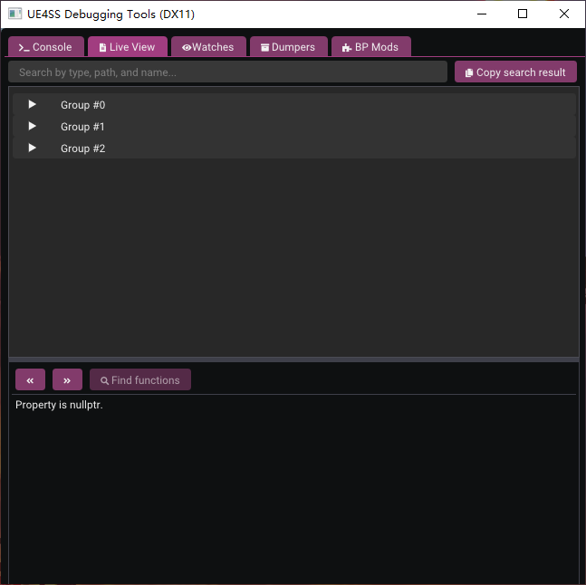
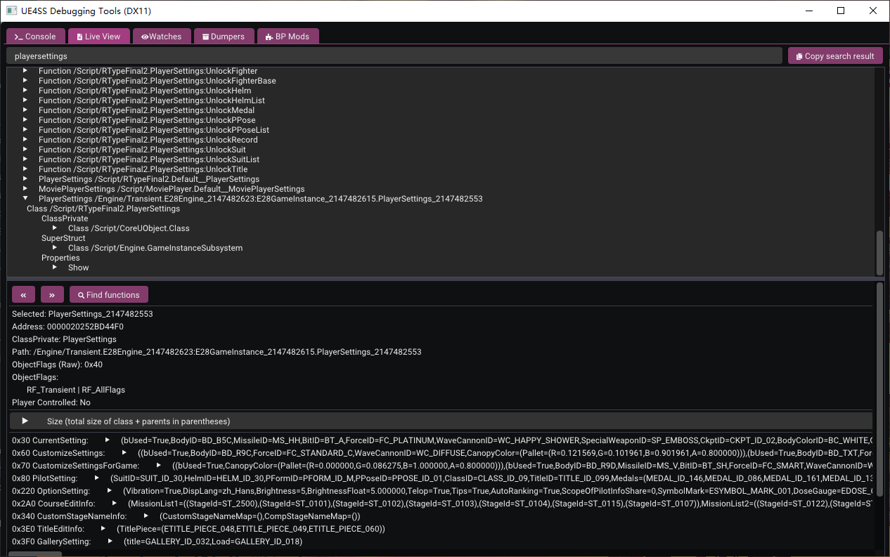
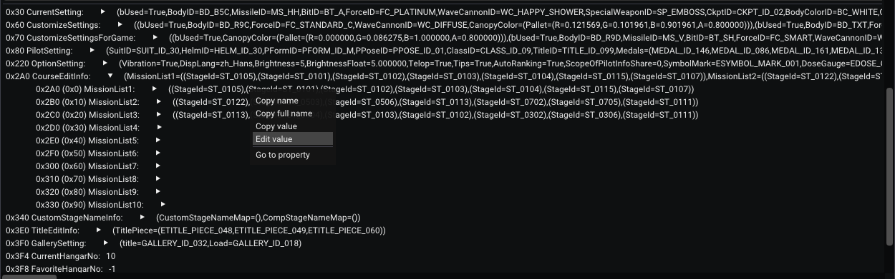
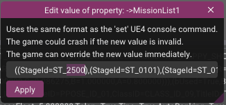
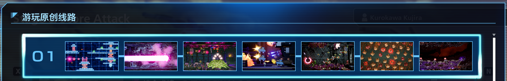
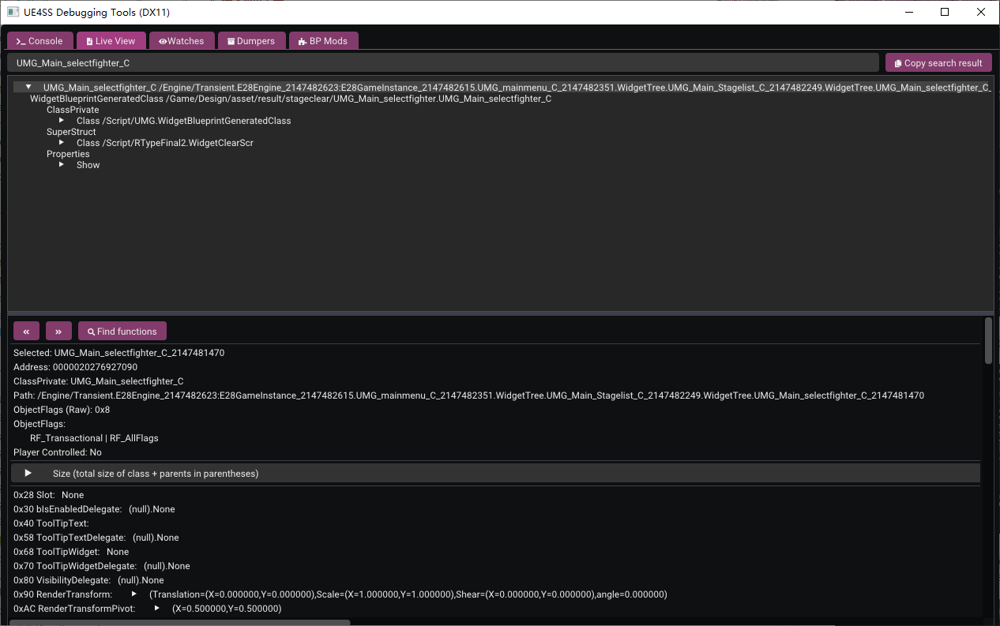
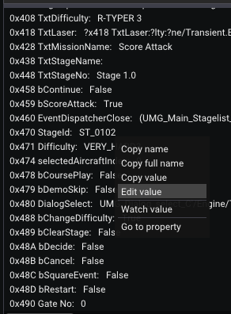
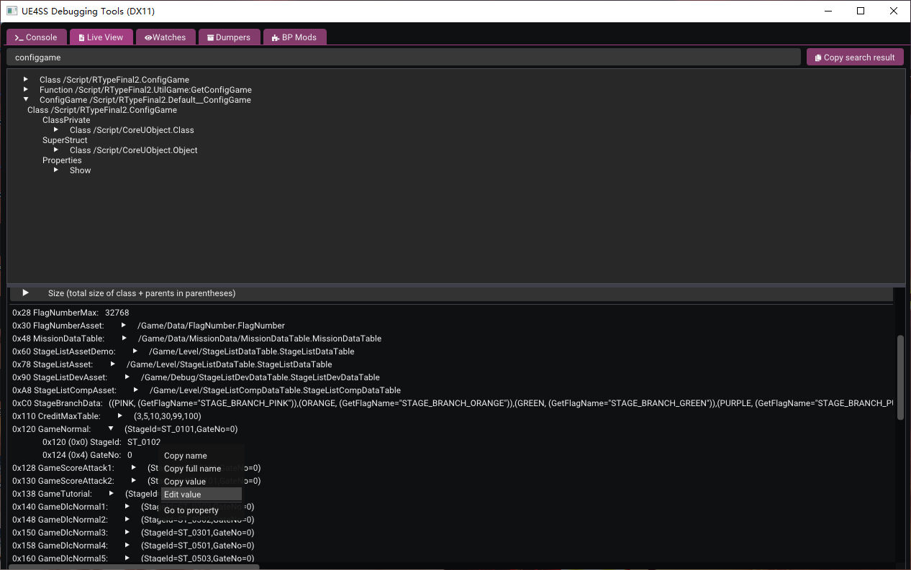

# Modステージに入る方法
現在、*Modで追加されたステージ* とその他の *未公開のステージ* はアーケードモードからはアクセスできず、スコアチャレンジモードにも表示されません。UE4SSのデバッグツールを使用して一部のデータを変更することで、正常にアクセスすることができます。

ここでは *["Stage G2.0 再現・逆流空間のストーンヘンジ"](https://github.com/BLACKujira/GradiusStage2Mod)* を例に、ステージに入る3つの方法を紹介します。

## 共通の前提条件
現在のステージModは以下の形式をとる場合があります：
- `LUA Mod` と 2つの `PAK Mod`
- `LUA Mod` と 1つの `PAK Mod` と 1つの `Blueprint Mod`

いずれの場合も、正常に動作するためにはすべてのパーツをインストールする必要があります。各タイプに対応したチュートリアルを参考にして、これらのModをインストールしてください。

この例では、インストール後にゲームを起動すると、次のような出力が表示され、3行はそれぞれのModが正常にインストールされたことを示しています（すべてのステージModに出力が表示されるわけではありません）。

```
[xx:xx:xx] [Lua] Add ST_2500 to Enum EStageId
...
[xx:xx:xx] [Lua] [GradiusStage2] GradiusStage2 Loaded
[xx:xx:xx] [Lua] [GradiusStage2] Definition of Stage G2.0 in StageList detected
```


次に、ステージの *ID* または *列挙名* を知っておく必要があります。通常、ステージの作成者はこれを提供します。この例では、ステージのIDは `100` 、列挙名は `ST_2500` です。

その後、ゲームを実行し、*UE4SS* のデバッグツールに移動して、`Live View` タブをクリックすると、次のような画面が表示されます。



次の操作は異なります。

## 方法1：カスタムルートを使ってステージに入る
**タイトル画面に少なくとも到達していることを確認してください**。ゲームのセーブデータが読み込まれていないときにこの操作を行わないようにしてください。

*Live View* の検索バーで `PlayerSettings` を検索し、`PlayerSettings_2147482553` オブジェクト（数字は異なる可能性があります）を見つけ、右クリックして `Instance only` をチェックすると見つけやすくなります。それをクリックすると、次のページが表示されます。



`CourseEditInfo` を展開し、`MissionList1` を右クリックして `Edit value` を選択します。



ウィンドウの下部で、最初の `StageId=` の後ろの内容を `ST_2500` または `100` に変更し、`Apply` をクリックします。この操作はカスタムルートの編集と同じですが、特殊なステージを選択できます。



成功すると、`MissionList1` の後ろの内容が `ST_2500` に変わります。もし `StageId=` が空のままだった場合、入力が正しいか、*ステージMod* の `LUA Mod` の部分が正しくインストールされているかを確認してください。

その後、*スコアチャレンジ* の *オリジナルルートプレイ* に移動すると、最初のルートの最初のステージが `Stage G2.0` に変わり、このルートを選ぶことで新しいステージをプレイできます。



もちろん、他のルートやステージも編集できます。この方法の利点は、ゲームをセーブすると、編集したステージデータも一緒に保存され、毎回再設定する必要がなくなることです。ただし、装備なしでゲームを開始する必要があります。

## 方法2：R戦機選択画面から入る
*スコアチャレンジ* で適当なステージを選び、*R戦機選択画面* に進んだ後、*UE4SS* のデバッグツールに切り替え、*Live View* の検索バーで `UMG_Main_selectfighter_C` を検索します（後ろの空白を注意してください。そうしないと大量のサブコンポーネントが表示され、見つけるのが難しくなります）。その後、`UMG_Main_selectfighter_C_2147481470` というオブジェクト（数字は異なる可能性があります）を選択します。



ウィンドウの下部にスクロールし、`0x470 StageId` というプロパティを見つけ、`ST_XXXX` の後ろを右クリックして `Edit value` を選びます。



ポップアップウィンドウで内容を `ST_2500` または `100` に変更し、`Apply` をクリックします。成功すると、`0x470 StageId` の値が `ST_0100` に変わったことに気付くでしょう。これは実際には表示の不具合で、この値は常に実際のIDの後の値を表示しますが、`ST_2500` の後にステージがないため、デフォルト値が表示されています。再度右クリックして編集すると、ウィンドウ内の値は正しく表示されます。

ゲームに戻ると、*R戦機選択画面* は変わりませんが、これは内部IDの変更が表示の更新を引き起こさないためです。R戦機を選んで決定すると、新しく追加されたステージをプレイできます。

ゲームが遅くなる場合は、*Live View* の検索バーを空にして、Enterキーを押してください。そうしないと、ゲーム内のオブジェクトが変更されるたびに検索がトリガーされ、かなりのパフォーマンス消費が発生します。

この方法の利点は、フル装備でステージに挑戦できることですが、ステージに入るたびに再設定が必要です。

## 方法3：ルートの開始ステージを変更して入る
前の方法と似ていますが、*Live View* の検索バーで `ConfigGame` を検索します（**`Instance only` を使わないように注意してください**）。`Default__ConfigGame` というオブジェクトを見つけ、ウィンドウの下部で `0x120 GameNormal` を展開し、`StageId` の値を右クリックして編集します。



ポップアップウィンドウで内容を `ST_2500` または `100` に変更し、`Apply` をクリックします。方法2と同様に、この値には表示の不具合があり、`ST_0100` と表示されるのは正常です。

その後、アーケードモードに入り、R戦機を選んでメインのステージに進むと、最初のステージが先ほど設定したステージに変わります。

この方法は前の2つの方法と特に大きな違いはなく、補助的な手段として使われます。

## 拡張読書：ステージModの各部分は何をしているか
ゲームがステージをロードする方法を理解することから始めましょう。ステージをロードする際、ゲームはまずそのIDを特定し、そのIDをもとにステージリストを検索し、リストからステージの詳細情報と対応するマップを探し出します。

そのため、ステージを追加するには、対応するマップや敵だけでなく、元のステージIDとステージリストも拡張する必要があります。これが `ステージMod` の3つの部分の役割です。

- `LUA Mod` はゲーム起動時に新しいステージIDを登録するために使用されます。
- `PAK Mod` は既存のステージリストを新しいステージを含むものに置き換えるために使用されます。
- そして、もう一つの `PAK Mod` または `Blueprint Mod` がステージの主要部分を担当します。

もちろん、これが現在使われている構成方法です。もし `Blueprint Mod` でステージIDを登録できれば、`LUA Mod` は省略できる可能性があります。また、もしUnreal Engineでデータテーブルを復元できれば、ステージリストを置き換える `PAK Mod` も別の `.pak` ファイルに統合できるかもしれません。したがって、将来的にはさらに最適化された `ステージMod` の構成が登場する可能性があります。

現在使われている方法は、*元のステージリスト* を *新しいステージを含むステージリスト* に置き換えるものなので、現時点では複数の `ステージMod` を同時にインストールすることはできません。そうしないと、1つのステージリストが他のものを上書きしてしまいます。同様に、これによりゲームが更新された後に新しい公式ステージが表示されない場合やロードできない場合があります。その場合は `ステージMod` を取り外してください。

## 拡張読書：Gateは何のために使われるのか
おそらく気づいたかもしれませんが、 `StageId` と一緒に `GateNo` が登場することがよくあります。実際、`GateNo` はゲーム内の各リスポーン地点の番号で、この番号によってステージのスクロール位置が決まります。

通常、`0` 番はステージに入るときの生成位置を意味し、`10` 番はステージの開始時に死亡した際のリスポーン地点を意味します。それ以外は `20`、`30`、`40` ... と続きます。

方法2および方法3では、`GateNo` を指定することができます。これにより、ステージ後半やボス戦の練習が便利になります。
