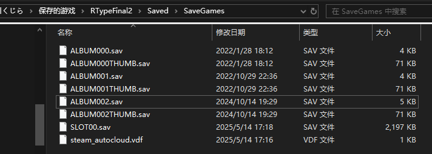

# セーブデータのバックアップ

ゲームを改造する際にセーブデータが変更されるのが嫌な場合や、何らかの理由でセーブデータが破損するのが心配な場合は、事前にバックアップを取っておくことをおすすめします。必要なときにセーブデータを元に戻すことができます。

## セーブデータの場所を特定する

通常、ゲームのセーブデータは以下の場所に保存されています：  
`C:\Users\{あなたのユーザー名}\Saved Games\RTypeFinal2\Saved\SaveGames\`  
`{あなたのユーザー名}` を *RTypeFinal2* をプレイしているときのシステムのユーザー名に置き換えてください。

- システムのバージョンや言語によっては、`Users` や `Saved Games` が `ユーザー` や `保存されたゲーム` などと表示されている場合があります。

- エクスプローラーのアドレスバーに  
`%USERPROFILE%\Saved Games\RTypeFinal2\Saved\SaveGames\`  
と入力すると、セーブデータのフォルダーへ直接移動できます。

## セーブデータのコピー

フォルダー内の `SLOT00.sav` がメインのセーブデータです。通常はこのファイルをバックアップすれば十分です。  
`ALBUM000.sav` のようなファイルはRアルバムに保存された機体のデータ、`ALBUM000THUMB.sav` のようなファイルはその機体のサムネイル画像です。

バックアップするには `SLOT00.sav` をコピーしてください。セーブデータを復元する場合は、**ゲームを終了した状態で** バックアップしたファイルを現在の `SLOT00.sav` に置き換えてください。
