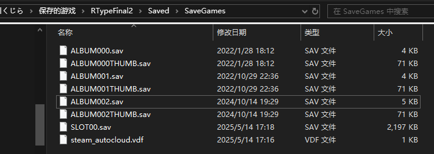

# 备份游戏存档

如果你希望在体验完Mod内容后将存档恢复到原来的状态，或是因为担心某种原因导致的存档损坏，可以选择先备份游戏存档，在有需要的时候将存档替换回去。

## 定位存档位置

通常情况下，游戏的存档保存在 `C:\Users\{你的用户名}\Saved Games\RTypeFinal2\Saved\SaveGames\` ，请将 `{你的用户名}` 替换为游玩 *RTypeFinal2* 时所使用的系统用户名。

- 根据系统版本和系语言的不同，`Users` 和 `Saved Games` 在资源管理器可能显示为不同的本地化名称，如 `用户` 和 `保存的游戏`。

- 在任务管理器的地址栏输入 `%USERPROFILE%\Saved Games\RTypeFinal2\Saved\SaveGames\` 通常可以直接导航到存档文件夹。

## 复制存档

文件夹中的 `SLOT00.sav` 就是游戏的主存档文件，通常备份这个文件就行了。而类似于 `ALBUM000.sav` 的是R相册中的战机存档，类似于 `ALBUM000THUMB.sav` 的则是对应战机的预览图。

复制 `SLOT00.sav` 即可备份存档。需要还原存档的时候请在 **关闭游戏的情况下** 使用备份的文件替换当前使用的的 `SLOT00.sav`。