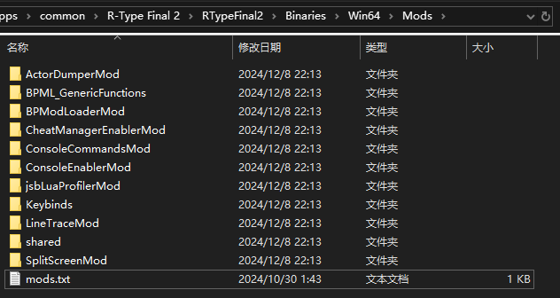
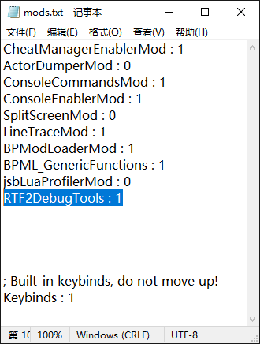

# 安装LUA Mod

## 什么样的Mod是LUA Mod
`LUA Mod` 通常是一个压缩文件，打开压缩文件，你可以看到一个与Mod名称相同的文件夹。这个文件夹中一定有一个叫 `Scripts` 的文件夹，而 `Scripts` 文件夹中一定有一个 `main.lua` 文件。

## 定位LUA Mod的安装位置
和安装UE4SS时一样，首先打开游戏的安装目录，之后进入到安装UE4SS的 `RTypeFinal2\Binaries\Win64` 文件夹。这个文件夹中应该有一个 `Mods` 文件夹。这个文件夹就是蓝图Mod的安装位置。

打开 `Mods` 文件夹，你应该可以看到许多预装的 `LUA Mod` 和一个 `mods.txt` 文件。



## 安装LUA Mod
打开 `LUA Mod` 的压缩文件，将其中 `与Mod名称相同的文件夹` 复制到 `Mods` 文件夹中。

打开 `mods.txt`，你可以看到与一个写着Mod名字的列表。

在Mod列表下方、 `; Built-in keybinds, do not move up!` 的上方添加一条 `(Mod的名称) : 1`
- 请将 `(Mod的名称) ` 替换为你所安装的Mod的名称，这个名称应该和 `与Mod名称相同的文件夹` 的名称相同。



### 以 RTF2DebugToolsMod 为例
1. 从 [RTF2DebugToolsMod](https://github.com/BLACKujira/RTF2DebugToolsMod) 的 [Releases](https://github.com/BLACKujira/RTF2DebugToolsMod/releases) 页面中下载 `RTF2DebugTools.zip` 这个文件。
2. 将 `RTF2DebugTools.zip` 中的 `RTF2DebugTools` 文件夹复制到 `Mods` 文件夹中。
3. 打开 `mods.txt` ，在Mod列表下方、 `; Built-in keybinds, do not move up!` 上方添加一条 `RTF2DebugTools : 1`
4. 如果安装成功，运行游戏后在UE4SS的控制台中可以看到这样的输出
```
[xx:xx:xx] Starting Lua mod 'RTF2DebugTools'
[xx:xx:xx] [Lua] RTF2 Debug Tools loaded
```