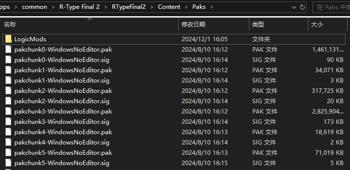
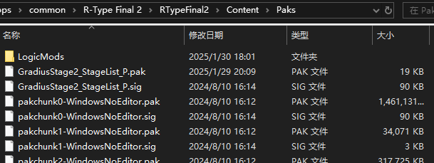

# 安装PAK Mod

## 什么样的Mod是PAK Mod
`PAK Mod` 是 `蓝图Mod` 的超集，其特征与 `蓝图Mod` 相同，都是以 `.pak` 结尾的文件。通常用于修改数值、替换贴图和音乐。不需要Mod加载器运行。

通常情况下，`PAK Mod` 的文件名以 `_P` 结尾，而 `蓝图Mod` 不会。

## 定位PAKMod的安装位置
和 `蓝图Mod` 一样，首先打开游戏的安装目录。之后打开 `RTypeFinal2` 文件夹，接下来再打开其中的 `Content` 文件夹、 再打开 `Paks` 文件夹。在这里，你可以看到许多成对的 `.pak` 文件和 `.sig` 文件。

这个文件夹就是放置 `PAK Mod` 的地方。

## 安装PAK Mod
将 `PAK Mod` 的 `.pak文件` 复制到 `Paks` 文件夹中。如果有 `.sig文件` 也需要一并复制进来。

如果没有.sig文件，请从 `Paks` 文件夹中随意**复制**一个 `.sig文件` ，并重命名为和 `.pak文件` 一样的名字。

- 与 `蓝图Mod` 不同，重命名 `.pak文件` 可能不会影响其效果，但最好不要这样做。尤其 **不要将名字里的 `_P` 去掉**。

### 以 替换标题画面的Mod 为例
1. 从 [RTypeFinal2MusicMod](https://github.com/BLACKujira/RTypeFinal2MusicMod) 的 [Releases](https://github.com/BLACKujira/RTypeFinal2MusicMod/releases) 页面中下载 `TitleBGM_Final_P.pak` 这个文件。
2. 将 `TitleBGM_Final_P.pak` 复制到 `Paks` 文件夹中。
3. 将 `Paks` 文件夹中的 `pakchunk0-WindowsNoEditor.sig` 复制一份，并重命名为 `TitleBGM_Final_P.sig`。
4. 运行游戏，如果安装成功，你会注意到标题画面的背景音乐发生了变化。

## 扩展阅读：PAK的资源覆盖规则
当两个不同的 `.pak文件` 包含相同位置和名称的资源时，游戏会根据 `.pak文件` 的名字决定使用哪个版本的资源文件（具体的规则我也不知道）。特别地，以 '_P' 结尾的 `.pak文件` 有着最高的优先级，所以这就是大部分 `PAK Mod` 的文件名以 '_P' 结尾，而去掉 '_P' 可能会导致Mod失效的原因。

这个特性似乎是为游戏补丁设计的，但为Mod开发者们提供了简单地替换游戏资源的方法。

当两个Mod（包括 `PAK Mod` 和 `蓝图Mod`）中包含相同位置和名称的资源时，毫无疑问也会发生资源覆盖，导致其中一个或两个Mod都不能正常运作。这很可能会发生在相同类型的Mod上。

## 扩展阅读：如何判断PAK Mod是否成功安装
由于 `PAK Mod` 不能主动运行自定义的逻辑，所以不能像 `蓝图Mod` 和 `LUA Mod` 一样输出成功安装的信息，只有当修改的内容出现在游戏中时才能判断安装是否成功。

如果你知道 `.pak文件` 的内容，可以使用 *UE4SS* 的调试窗口查看对应的资源来判断是否安装成功。

有时候，作者会发布检验安装用的 `蓝图Mod` 或 `LUA Mod` ，通过这些Mod主动检测安装状态并输出信息。也有时候作者会替换一个容易找到的内容来标记安装成功，比如说得分挑战中的关卡图片。