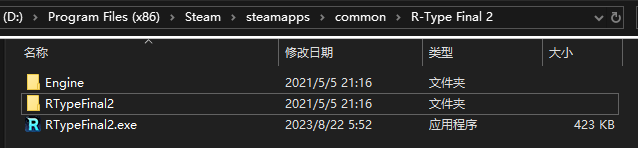
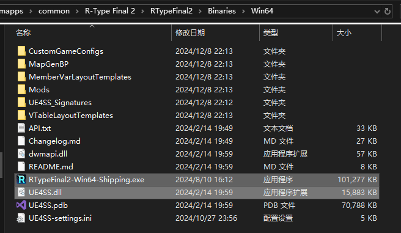
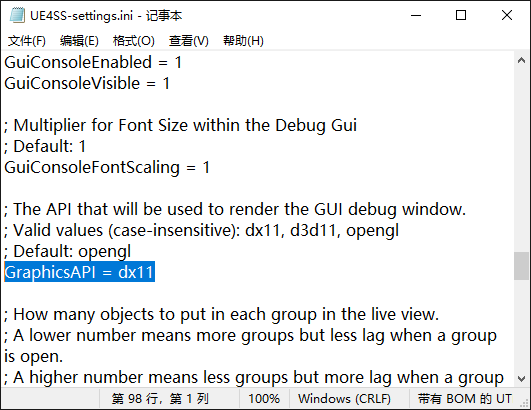

# 安装UE4SS
在开发或使用 *R-Type Final 2* 的 MOD 之前，安装 UE4SS 是必不可少的第一步。  

*UE4SS* 是一个强大的工具，其不仅提供了对两种主流Mod—— `LUA Mod` 和 `蓝图Mod` 的支持，还包括查看和编辑关卡内对象、导出映射文件和接头文件等重要功能，接下来的的大部分内容都需要其作为基础。  

在这个教程中，我们将学习如何安装开发者版本的 `UE4SS v3.0.0` ，并升级到 `v3.0.1`，最后验证安装，并排除可能的问题。  

## 下载UE4SS
首先进入 [UE4SS-RE/RE-UE4SS](https://github.com/UE4SS-RE/RE-UE4SS) ，点击页面右侧的 [Releases](https://github.com/UE4SS-RE/RE-UE4SS/releases)，下载 `zDEV-UE4SS_v3.0.1.zip` 。下滑页面，同样下载 `zDEV-UE4SS_v3.0.0.zip` 。

注意，这两个版本都需要下载，因为必须要先安装 `v3.0.0` 版本的UE4SS能升级到 `v3.0.1` 版本。

## 寻找安装目录
以Steam版为例，右击游戏图标，在弹出的菜单中选择 `管理` -> `浏览本地文件` ，即可打开游戏的安装目录。这里应该有一个名叫 `RTypeFinal2.exe` 的可执行文件和 `Engine` 、 `RTypeFinal2` 文件夹。如果你购买了OST，这里还会有OST的文件夹。

打开 `RTypeFinal2` **文件夹**，再打开其中的 `Binaries` 文件夹，最后打开其中的 `Win64` 文件夹。在这里，你应该能看到 `RTypeFinal2-Win64-Shipping.exe` 这个文件，这里就是UE4SS的安装目录。

## 安装 UE4SS v3.0.0
将 `zDEV-UE4SS_v3.0.0.zip` 中的内容全部解压至此，如果操作正确，文件夹的样子将如图所示。

此时启动游戏，如果安装成功，你将可以看到UE4SS的控制台伴随游戏一起启动。如果没有，请检查之前的操作是否正确。如果操作无误，嗯...那就麻烦了，请参照 [手动注入UE4SS](手动注入UE4SS.md) 解决这个问题。

如果控制台为一片空白，也不需要担心，在升级为 `v3.0.1` 版本之后再解决这个问题。

## 升级到 UE4SS v3.0.1
将 `zDEV-UE4SS_v3.0.1.zip` 的内容解压到和之前同样的文件夹，覆盖所有相同名称的文件。这样就升级到 `UE4SS v3.0.1` 了。

## 解决控制台的显示问题
如果UE4SS的控制台为全黑或全白，请找到UE4SS安装目录中的 `UE4SS-settings.ini` 这个文件。

使用任何文本编辑器打开 `UE4SS-settings.ini` 。在文本编辑器中定位到 `GraphicsAPI = opengl` 这一行，并修改为 `GraphicsAPI = dx11`。

## 接下来...
如果UE4SS安装成功，接下来就可以安装Mod了。根据Mod类型的不同，安装方式也不同，请参照下面的教程安装不同类型的Mod。
- [安装蓝图Mod](安装蓝图Mod.md)
- [安装LUA Mod](安装LUAMod.md)

有一些Mod可能需要同时安装 `LUA Mod` 和 `蓝图Mod` 的部分才能正常运行。

## 扩展阅读：为什么建议安装开发者版本的、最新版的UE4SS
开发者版本默认情况下控制台是开启的，新手不需要修改配置文件即可直观的判断出UE4SS是否已经正常运行。同时控制台中输出的信息也可以用来判断Mod是否被正确安装。

此外，由于游戏的武器、机体、关卡资料都记录在数据表中，当多个不同的Mod添加这些内容时，为了防止冲突，需要在运行时将信息添加到数据表中，而不是直接覆盖原来的数据表。

目前的UE4SS还没有这个功能，但很可能在近期的某个版本中加入，为了预备版本的升级，建议使用最新的 `v3.0.1` 版本进行Mod的开发，自然也需要这个版本来加载Mod。
