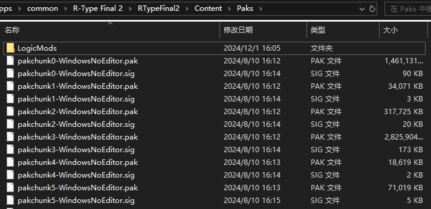

# 安装蓝图Mod

## 什么样的Mod是蓝图Mod
`蓝图Mod` 是一种特殊的 `PAK Mod` ，其特征与PAK Mod相同，都是以 `.pak` 结尾的文件，但需要UE4SS这样的Mod加载器才能正常工作。其安装方式和 `PAK Mod` 略有区别，请根据Mod作者给出的信息判断究竟是哪种Mod。

通常情况下，`PAK Mod` 的文件名以 `_P` 结尾，而 `蓝图Mod` 不会。

## 定位蓝图Mod的安装位置
和安装UE4SS时一样，首先打开游戏的安装目录。之后打开 `RTypeFinal2` 文件夹，接下来再打开其中的 `Content` 文件夹、 再打开 `Paks` 文件夹。在这里，你可以看到许多成对的 `.pak` 文件和 `.sig` 文件。



如果之前至少运行过一次成功安装UE4SS后的游戏，`Paks` 文件夹中会出现一个 `LogicMods` 文件夹，这个文件夹就是蓝图Mod的安装位置。

- 如果在运行成功安装UE4SS后的游戏后这个文件夹也没有出现，请手动创建 `LogicMods` 文件夹。

## 安装蓝图Mod
将蓝图Mod的 **`.pak文件`** 复制到 `LogicMods` 文件夹中。如果有 `.sig文件` 也需要一并复制进来。

如果没有.sig文件，请从 `Paks` 文件夹中随意**复制**一个 `.sig文件` ，粘贴到 `LogicMods` 文件夹中，并重命名为和 `蓝图Mod` 的 `.pak文件` 一样的名字。


### 以 SimpleBossLifeBarMod 为例
1. 从 [SimpleBossLifeBarMod](https://github.com/BLACKujira/SimpleBossLifeBarMod) 的 [Releases](https://github.com/BLACKujira/SimpleBossLifeBarMod/releases) 页面中下载 `SimpleBossLifeBar.pak` 这个文件。
2. 将 `SimpleBossLifeBar.pak` 复制到 `LogicMods` 文件夹中。
3. 将 `Paks` 文件夹中的 `pakchunk0-WindowsNoEditor.sig` 复制到 `LogicMods` 文件夹中，并重命名为 `SimpleBossLifeBar.sig`。
4. 运行游戏，如果安装成功，运行游戏后，你可以在UE4SS的控制台中看到这样的输出
```
[xx:xx:xx] [Lua] [SimpleBossLifeBar] ModActorPath: /Game/Level/title/title.title:PersistentLevel.ModActor_C_2147482405
[xx:xx:xx] [Lua] [SimpleBossLifeBar] WE ARE NOW RUSHING INTO STAGE 0 BE ON YOUR GUARD!
```

## 扩展阅读：.pak 文件究竟是什么
`.pak文件` 是虚幻引擎的资源文件，其中存放着游戏的贴图、材质、音乐、地图等内容。

虚幻引擎在设计时考虑到了为这类文件打补丁的情况，一个 `.pak文件` 中的内容可以覆盖另一个 `.pak文件` 的内容，`PAK Mod` 就是借助这种特性来修改游戏中的内容。但 `PAK Mod` 通常是静态的，只能改变游戏的画面、声音、数据，不能添加新的游戏内容。

而 `蓝图Mod` 的 `.pak文件` 中包含一个特殊入口对象。借助UE4SS这样的Mod加载器，可以将这个入口对象生成到关卡中，从而实现游戏内容的扩展。

## 扩展阅读：.sig 文件究竟是什么
`.sig文件` 是 `.pak文件` 的签名文件，游戏在加载 `.pak文件` 时会检查是否存在对应的 `.sig文件`，如果缺少 `.sig文件`，`.pak文件` 将不会被加载。所以 `Paks` 文件夹中的 `.sig文件` 和 `.pak文件` 文件是成对出现的。

同样的，由Mod作者添加的 `.pak文件` 也需要有对应的 `.sig文件`。幸好游戏并不会对 `.sig文件` 进行更细致的验证，所以Mod开发者并不需要弄明白 `.sig文件` 是如何生成的。只需要将游戏本身的 `.sig文件` 复制一份，并重命名为和 `.pak文件` 相同的名字就可以骗过游戏了。