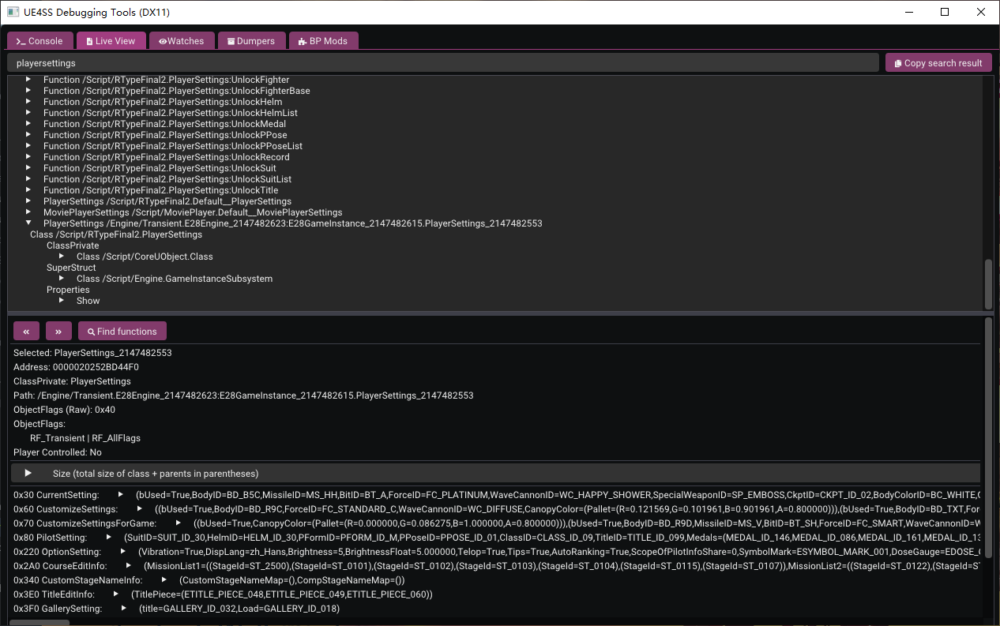
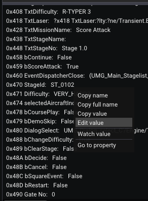

# 进入Mod关卡
目前 *Mod添加的关卡* 和其它 *未正式发布的关卡* 无法通过街机模式进入，也不会显示在得分挑战模式中，需要借助UE4SS的调试工具修改一些数据才能正常进入。

下面以 *["Stage G2.0 重现・逆流空间中的巨石阵"](https://github.com/BLACKujira/GradiusStage2Mod)* 为例，介绍三种进入关卡的方式。

## 通用前置
目前的关卡Mod可能有以下的形式
- 一个 `LUA Mod` + 两个 `PAK Mod`
- 一个 `LUA Mod` + 一个 `PAK Mod` + 一个 `蓝图Mod`

无论是哪种形式，都需要安装所有部分才能正常运作。请参照对应类型的教程分别安装这些Mod。

在本例中，安装成功后启动游戏你会看到这样的输出，三行分别对应三种Mod已经安装成功。（并不是所有关卡Mod安装成功后都有输出）

```
[xx:xx:xx] [Lua] Add ST_2500 to Enum EStageId
...
[xx:xx:xx] [Lua] [GradiusStage2] GradiusStage2 Loaded
[xx:xx:xx] [Lua] [GradiusStage2] Definition of Stage G2.0 in StageList detected
```

其次需要知道关卡的 *ID* 或 *枚举名*，通常情况下关卡作者会提供这些。在这个例子中，关卡的ID为 `100` ， 枚举名为 `ST_2500`。

之后运行游戏，转到 *UE4SS* 的调试工具，点击 `Live View` 标签页，你将会看到这样的页面


接下来的操作就不同了

## 方法1：通过自定义路线进入
请确保你**至少已经进入标题画面** ，请不要在游戏存档还没有读取时进行这个操作。

在 *Live View* 的搜索框中搜索 `PlayerSettings`，找到 `PlayerSettings_2147482553`
 这个对象（数字可能不同，右击搜索框勾选 `Instance only` 会更容易找到），点击它，你会看到下面的页面。



展开 `CourseEditInfo` ，右击 `MissionList1`，选择 `Edit value`


在窗口的下半部分中将第一个 `StageId=` 后面的内容改为 `ST_2500` 或 `100`，点击 `Apply`。这个操作相当于编辑自定义路线，但可以选择特殊的关卡。


如果成功， `MissionList1` 后面的内容中第一位会变成 `ST_2500`。如果 `StageId=` 后面显示为空，请检查输入是否正确以及 *关卡Mod* 中 `LUA Mod` 的部分是否正确安装。

接下来进入 *得分挑战* 中的 *游玩原创线路* ，你会发现第一条线路的第一关变成了 `Stage G2.0`，进入这条路线就可以玩到新添加的关卡。


当然，你也可以编辑其它路线的其它关卡。这种方法的优点是，在保存游戏时会将编辑的关卡数据一并保存，不用每次都重新编辑。但只能在无装备的情况下开始游戏。

## 方法2：通过选择R战机的界面进入
在 *得分挑战* 随意选择一个关卡，进入 *选择R战机的界面* ，此时切换到 *UE4SS* 的调试工具，在 *Live View* 的搜索框中搜索 `UMG_Main_selectfighter_C `（注意后面的空格，否则会出现大量子组件导致很难找到），选择 `UMG_Main_selectfighter_C_2147481470` 这个对象（数字可能不同）。


在窗口的下半部分下滑，找到 `0x470 StageId` 这个属性，右键后面的 `ST_XXXX` 选择 `Edit value`。



将弹出窗口中的内容改为 `ST_2500` 或 `100`，点击 `Apply`，如果成功，你会注意到 `0x470 StageId` 的值变为了 `ST_0100`。这实际上是一个显示错误，这个值总是显示为真实ID的后一个，而 `ST_2500` 后面没有关卡，所以显示为了默认值。如果再次右键编辑这个值会发现编辑窗口中的值是对的。

回到游戏，你会发现 *选择R战机的界面* 毫无变化，这是正常的，改变内部ID不会触发刷新显示。选择R战机并确定，就可以游玩新添加的关卡了。

如果游戏卡顿，请清空 *Live View* 的搜索框并按下回车。否则每次游戏中的物体发生变动都会触发搜索，这会消耗相当多的性能。

这种方法的优势是可以以满装备挑战关卡，但每次进入关卡前都需要重新设置。

## 方法3：通过修改路线起始关卡进入
和之前的方法类似，在 *Live View* 的搜索框中搜索 `ConfigGame` （**注意不要使用 `Instance only`**），找到 `Default__ConfigGame` 这个对象，在窗口的下半部分找到并展开 `0x120 GameNormal`，右键 `StageId` 的值并编辑。


将弹出窗口中的内容改为 `ST_2500` 或 `100`，点击 `Apply`。和方法2一样，这个值有一些显示问题，显示为 `ST_0100` 是正常的。

此时进入街机模式，选择R战机并进入主线关卡，你会发现第一关变成了刚刚设置的关卡。

这种方式相对前两种方式并没有特别的优势，仅作为备用手段。

## 扩展阅读：关卡Mod各个部分究竟是做什么的
首先我们要了解一下游戏加载关卡的方式，当加载一个关卡时，游戏首先会确定关卡的ID，之后根据ID找到关卡列表，再从关卡列表中找到关卡的具体信息和对应的地图。

所以要添加一个关卡，不仅要添加对应的地图和敌人，还要扩展原有的关卡ID和关卡列表。而这就是 `关卡Mod` 三个部分的作用了

- `LUA Mod` 用于在游戏启动时注册新的关卡ID
- `PAK Mod` 用于将原有的关卡列表替换成包含新关卡的关卡列表
- 而另一个 `PAK Mod` 或 `蓝图Mod` 才是关卡的主要部分

当然，这只是现在使用的构成方式。如果能在 `蓝图Mod` 中注册关卡ID，`LUA Mod` 则可以省去。此外如果能在虚幻引擎中还原数据表，用于替换关卡列表的 `PAK Mod` 也可以合并到而另一个 `.pak文件` 中。所以未来很有可能会出现更优化的 `关卡Mod` 构成。

由于目前使用的方法是将 *原有的关卡列表* 替换成 *包含新关卡的关卡列表*，所以暂时不能同时安装多个 `关卡Mod`，否则其中一个的关卡列表会覆盖另一个。同样的，这还会导致游戏更新后的新官方关卡无法显示或加载，如果出现这种情况，请移除 `关卡Mod`。

## 扩展阅读：Gate是做什么用的
或许你注意到了， `StageId` 总是和 `GateNo` 一起出现。其实，`GateNo` 就是游戏中每个复活点的编号，根据这个编号决定进入关卡时卷轴的位置。

通常来说 `0` 号代表直接进入关卡时的生成位置，`10` 号代表在关卡开头死亡时的复活点，剩下`20`、`30`、`40` ... 以此类推。

在第二种、第三种进入关卡的方法中都可以指定 `GateNo`，这为关卡后半和Boss战的练习提供了便利。