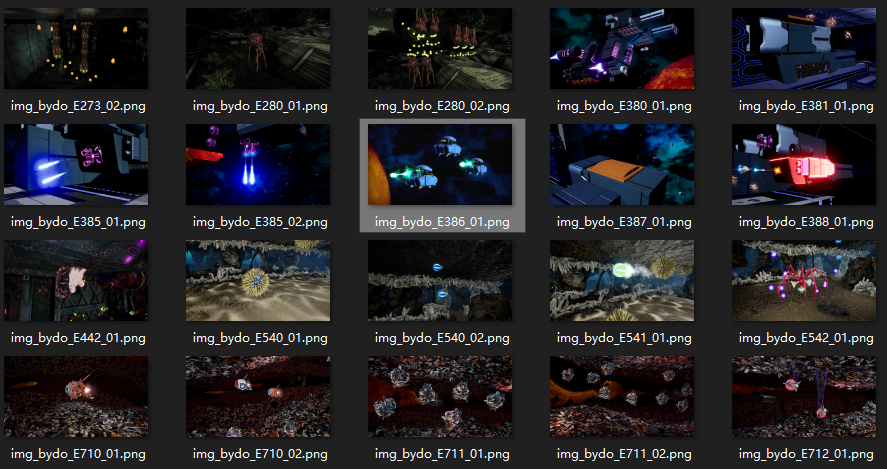

# 通过BydoLab中敌人的图片定位敌人ID

- 首先在FModel中定位到 `Content/Design/texture/Bydolabo/img_bydo` ，提取这个文件夹中所有的图片

- 接下来进入保存提取图片的文件夹，根据敌人的外观找到需要的敌人，其文件名中间的一段就是它的编号

根据这个编号，你可以找到以下内容

- `/Content/Enemy/编号/编号ParamAsset.uasset` 是敌人的定义对象，其记录了敌人对应的类、敌人的参数。可以用于在关卡中创建对象池。
- `/Content/character/Enemy/编号/` 中存放了敌人的模型、动画、贴图和材质（对于Y路线、Z路线和后期添加的关卡则是在对应的插件中）
- 在 `/Content/Data/BydoData.uasset` 搜索这张图片，你还可以得知其本地化键的名字

## 以Stage 3.0、Stage X6.0出现的悬浮炮台为例

- 首先根据图片确定其ID为E386
- 其对应的敌人定义就是 `/Content/Enemy/E386/E386ParamAsset.uasset`
- 其发射的子弹对应的定义就是 `/Content/Enemy/E386/S386ParamAsset.uasset`
- 其对应的模型是 `/Content/character/Enemy/E386/E386_01.uasset`
- 它在 `/Content/Data/BydoData.uasset` 对应的编号是 `102`，本地化键名为 `NAME_103_SourceString`

# 后记

虽然游戏中的确存在编号和敌人的对应关系，但实际上并没有一个全局的敌人列表。而 *BydoLab* 只记录了已经发布的关卡中的敌人。所以通过这种方式不能得知未发布关卡中敌人的编号。