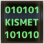

# ツールリスト

この記事では、*R-Type Final 2* のMod開発プロセスで必要なツールを紹介します。

これらは *UE4/5* Mod開発エコシステムの一部に過ぎません。*UE4/5* Mod開発に使用されるツールについては、[UE-Modding-Tools](https://github.com/Buckminsterfullerene02/UE-Modding-Tools) を参照してください。

これらのツールの多くは、一般的な検索エンジンでは情報を見つけることが難しいです。詳細については [Unreal Engine Modding Discord](https://discord.gg/VYjh4vSq) に参加することを強くお勧めします。

## Mod開発に必須のツール

### （重要）UE4SS

このチュートリアルで使用するコア技術で、非常に基本的で重要です。ほとんどすべてのチュートリアルで使用されます。

これには、*`.usmap`* マッピングファイルのエクスポート、*UHTヘッダーファイル* のエクスポート、マップ内のActor情報のエクスポートなど、重要な機能が統合されています。

### （重要）Unreal Engine 4.26

これは *R-Type Final 2* で使用されているエンジンで、*Blueprint Mods* や *PAK Mod（ベイクが必要なもの）* の開発に必要な環境です。推奨バージョンは `4.26.2` です。

---

###  （重要）Visual Studio 2019 & C++ 開発環境

Unreal Header Tool（UHT）ファイルを使用するには、*Unreal Engine 4.26* 用の *C++* 開発環境が必要です。これには *Visual Studio 2019* をインストールする必要があります。

*Unreal Engine 4.26* の制限により、*Visual Studio 2022* は認識されませんが、[Redditの投稿](https://www.reddit.com/r/VisualStudio/comments/171cncs/how_to_download_an_old_released_version_of_visual/?rdt=62270) で発見された *Wayback Machine* を使って *Visual Studio 2019* のインストールプログラムを簡単にインストールできます。

（構成ファイルやコードを修正することで、*Unreal Engine 4.26* が *Visual Studio 2022* をサポートするようにすることもできるようです。）

---

### （重要）AES Key Finder

ゲームのAESキーを自動的に発見するためのツール。ゲームリソースをアンパックするためには正しいキーが必要です。

*R-Type Final 2* バージョン `2.0.3` では、4つの可能なキーが見つかり、そのうち1つが正しいものです。

---

### （重要）FModel

現在、最も主流な *PAK解凍ツール*。基本的な解凍機能に加え、モデル、テクスチャ、音楽の一部のプレビューも可能です。最も重要なのは、*.uasset* ファイルを *JSON* に変換できるため、プロパティ情報を簡単に読み取ることができる点です。

使用には *AESキー* と *.usmap* マッピングファイルが必要です。AESキーは *AES Key Finder* を使って取得でき、*.usmap* ファイルは *UE4SS* や *dumper-7* を使ってエクスポートできます。

モデルやアニメーションの抽出に関しては *UModel* より劣るようです。

---

### （重要）UAssetGUI

*.uasset* ファイルを編集するための専用ツールで、*FModel* や *UnrealPak* と組み合わせて使います。ゲーム内の数値を変更したり、データテーブルに新しい行を追加することができます。*PAK Mod（ベイク不要）* や *レベルMod* を作成するためには必須のツールです。

データテーブルに新しい行を追加した後、ファイルを保存して再読み込みしないと行内容を編集できません。

---

### （重要）UnrealPak

フォルダやリソースファイルを `.pak` ファイルに再パッケージングするためのツールで、*FModel* や *UAssetGUI* と組み合わせて使われます。*PAK Mod（ベイク不要）* の作成にも必須のツールです。

通常、`UnrealPak-With-Compression.bat` を使ってパッキングします。`UnrealPak-Without-Compression.bat` を使用するとどうなるかはまだ不明です。

---

###  Kismet Analyzer

*.uasset* や *.umap* に含まれるブループリントロジックを解析し、そのロジックをフローチャートに変換するツールです。フローチャートを参照することで、Unreal Engine内でブループリントロジックを復元できます。

これを使用するには *FModel* と組み合わせて、パラメータ、変数、関数などの詳細なプロパティを取得する必要があります。

## 逆コンパイル、C++コードのフック

このセクションは私が最初に失敗した試みから生まれました。現在のMod開発プロセスでは、これらのツールはほとんど必要ありません。

### dumper-7

*UFunction* を呼び出し可能でフック可能なC++関数に変換し、プロジェクトのSDKを生成できます。その他の機能は *UE4SS* と似ており、*.usmap* マッピングファイルのエクスポートも可能です。IDA用のシンボルセットをエクスポートできることが重要です。

ほとんどの場合、*UE4SS* を代わりに使用でき、ほとんど使うことはありません。生成されたSDKは *DLL注入ライブラリ*（Detoursなど）と組み合わせて使用されます。

注意：非同期スレッド内のフック（例えばセーブゲームスレッド）はトリガーされません。

---

### IDA

ディスアセンブラー＆デバッガで、ゲームのDLLファイルからゲームの実行ロジックを解明するために使用されます。シンボルセットが一部にしか対応していないため、実際の操作は非常に困難です。

*dumper-7* がエクスポートしたシンボルセットを使用するには、バージョンが `8.3` 以上である必要があります。さもないと、プラグインを使用できません。

---

### X64DBG

デバッガで、ゲームのメモリやアセンブリを見ることができ、フックが関数をフックしているか確認できます。また、ゲームがクラッシュした際に出力される情報の一部を見ることができます。

IDAのデバッグ機能に比べると高速ですが、シンボルセットをロードすることができません。
