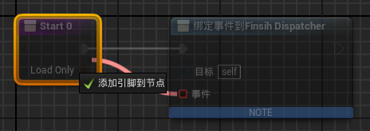

# デリゲートを関数の引数として使用する
ゲーム内のブループリントのDummyを作成する際、`DelegateProperty` 型の関数引数があることに気付くかもしれません。例えば、以下のような例です。しかし、ブループリント内では引数の型に *デリゲート* の選択肢がないようです。

```json
{
"Type": "Function",
"Name": "Start",
"Outer": "PlayerLoader_C",
"Class": "UScriptClass'Function'",
"ChildProperties": [
    {
    "Type": "BoolProperty",
    "Name": "LoadOnly",
    "Flags": "RF_Public",
    "ElementSize": 1,
    "PropertyFlags": "BlueprintVisible | BlueprintReadOnly | Parm",
    "FieldSize": 1,
    "ByteOffset": 0,
    "ByteMask": 1,
    "FieldMask": 255,
    "BoolSize": 1,
    "bIsNativeBool": true
    },
    {
    "Type": "DelegateProperty",
    "Name": "イベント",
    "Flags": "RF_Public",
    "ElementSize": 20,
    "PropertyFlags": "ConstParm | BlueprintVisible | BlueprintReadOnly | Parm | OutParm | ReferenceParm",
    "SignatureFunction": {
        "ObjectName": "Function'PlayerLoader_C:FinsihDispatcher__DelegateSignature'",
        "ObjectPath": "RTypeFinal2/Content/Player/PlayerLoader.0"
    }
    }
],
"FunctionFlags": "FUNC_Public | FUNC_HasOutParms | FUNC_BlueprintCallable | FUNC_BlueprintEvent"
},
```

実際、この問題の解決方法は非常に簡単です。関数内でデリゲート引数を持つノードを作成し、そのデリゲート型のピンを入力ノードにドラッグして新しいピンを追加するだけで解決できます。



こうして作成した入力引数の名前は、現在の Unreal Engine の使用言語である `イベント` という単語になります。つまり、ゲーム内でのデリゲート型の引数は基本的に `イベント` という名前が付けられており、これはこのように作成されているからだと思われます。
