# BGMの差し替え

Unreal Engine では、`.pak` ファイルがさまざまなリソースをまとめるために使用されます。  
ゲーム実行時には特定の優先順位で `.pak` ファイルが読み込まれ、同じパスのリソースが複数存在する場合は、**後から読み込まれた方が上書き**されます。

Unreal Engine では、パッチや DLC システムを便利に扱うため、ファイル名に `_P` が付いた `.pak` は**最高優先度**で読み込まれるようになっています。  
したがって、オリジナルと同じリソースパスの差し替えファイルを `_P.pak` として作成すれば、元のファイルを変更せずにゲーム内の音声を上書きできます。

---

### CUE ファイルについて

*R-Type Final 2* の音楽や効果音は、`Sound Cue` リソースファイルによって制御されています。  
`Sound Cue` は「オーディオのロジックブループリント」のようなもので、音声ファイルの再生方法（再生順、ループ、フェード、音量制御など）を定義します。

ゲームの BGM に対応する `Sound Cue` は  
`RTypeFinal2/Content/Sound/Cue`  
に保存されています。

つまり、**同じパスと名前**の `Sound Cue` を作成し、それが自分の音楽を再生するように設定して `_P.pak` としてパッケージ化すれば、ゲーム内の音楽を置き換えることができます。

## ステップ1：プロジェクトを作成する

1. *Unreal Engine 4.26.2* を起動します。

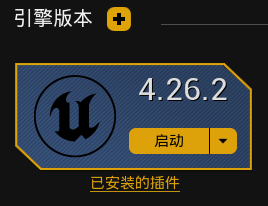

2. 「新規プロジェクトタイプ」→「ゲーム」を選択し、「次へ」をクリック。

3. テンプレートを「空白」に設定して「次へ」。

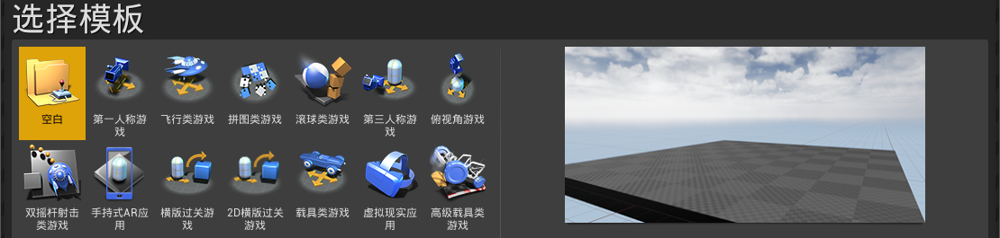

4. プロジェクトタイプを「ブループリント」に設定。

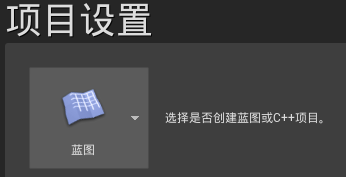

5. 保存場所を指定し、**プロジェクト名を `RTypeFinal2`** に設定。

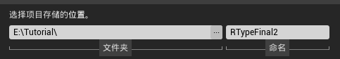

6. 「プロジェクトを作成」をクリックしてしばらく待機。

## ステップ2：ダミーのサウンドクラスを作成

CUE ファイルは「サウンドクラス（Sound Class）」に依存しており、再生ロジック（音量、フェードなど）を制御します。  
ゲームが正しく CUE を認識し、元の再生ロジックを維持するために、同じ名前とパスを持つ「ダミーのサウンドクラス」を作成します。  
これはあくまで**参照用の空クラス**であり、ゲーム内ではオリジナルのクラスが使われます。

1. コンテンツブラウザで右クリックし、フォルダを作成して `Sound` と命名。

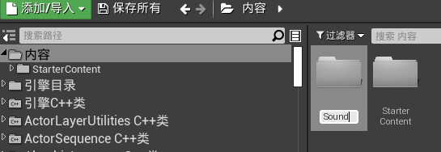

2. `Sound` 内に `Mix` フォルダを作成。構造は次のようになります。

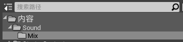

3. `Mix` フォルダで右クリック → 「サウンド」→「クラス」→「サウンドクラス」を選択。

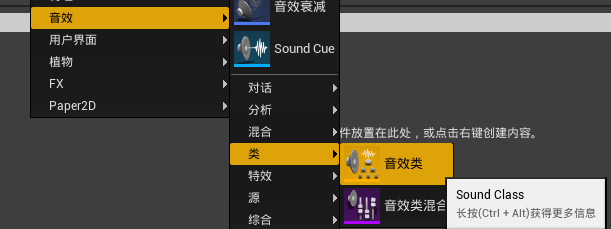

4. 作成したサウンドクラスを `Sound_BGM` と命名。

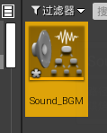

> この `Sound_BGM` は最終的な PAK には含めません。エディタ上で CUE の参照を正しく解決するためだけに使用します。

## ステップ3：音声ファイルを編集

1. 任意の音声編集ソフト（または動画編集ソフト）で差し替えたい音楽を開きます。  
2. 音声を「イントロ部分」と「ループ部分」に分割します。（イントロ付きループでも可）

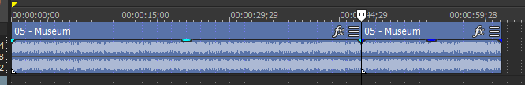

3. 波形などを参考に、ループ開始と終了の位置を正確に合わせます。

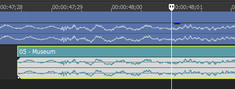

4. それぞれを個別にエクスポートします。形式は WAV または OGG（高ビットレート推奨）。

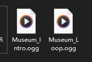

## ステップ4：置き換える Sound Cue を特定

1. `FModel` を開き、ゲームの `.pak` ファイルを読み込みます。  
2. `RTypeFinal2/Content/Sound/Cue` フォルダ内から目的の `Sound Cue` を探します。

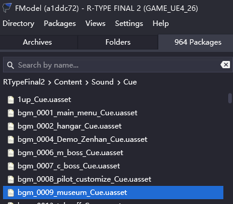

3. `Sound Cue` アセットをダブルクリックし、右側の JSON ビューの下部にある  
   `Type` が `SoundNodeWavePlayer` または `SoundNodeOggPlayer` のノードを探します。

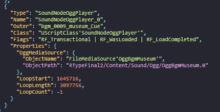

4. そのノードの `AssetPathName` または `ObjectPath` をクリックすると、FModel のプレイヤーが開きます。  
5. 再生して、対象の BGM であることを確認します。

## ステップ5：CUE を作成

1. Unreal Engine に戻り、`Sound` フォルダ内に `Cue` フォルダを作成。

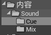

2. 編集済みの音声ファイルをプロジェクトにインポート（推奨：Cue フォルダ内）。

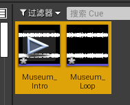

3. `Cue` フォルダで右クリック → 「サウンド」→「Sound Cue」を作成し、  
   元の CUE と同じ名前を付けます。

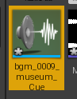

4. 作成した `Sound Cue` を開き、左側の「クラス」を `Sound_BGM` に設定。

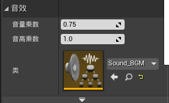

5. 右側のグラフで「コンキャットネーター（Concatenator）」ノードを追加し、出力ノード（スピーカーアイコン）に接続。

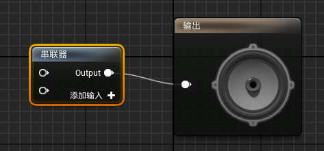

6. 2つの音声ファイルをドラッグして追加し、自動でノードが作成されます。  
7. 「イントロ部分」を1つ目、「ループ部分」を2つ目に接続。

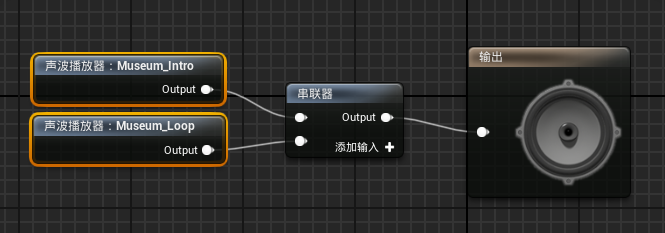

8. 「ループ部分」のノードを選択し、左側のプロパティで「ループ」にチェック。

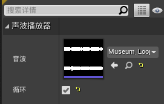

## ステップ6：特定のチャンクに割り当て

1. メニューから「編集」→「プロジェクト設定」を開きます。

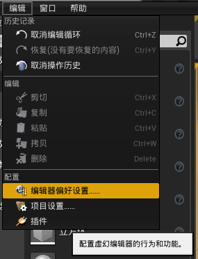

2. 「パッケージ化」セクションで「ファイルチャンクを生成」にチェック。

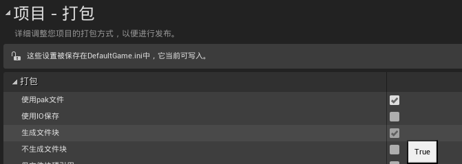

3. メニューから「編集」→「エディタ設定」→「実験的機能」→  
   「ユーザーインターフェース」→「チャンク ID の指定を許可」にチェック。

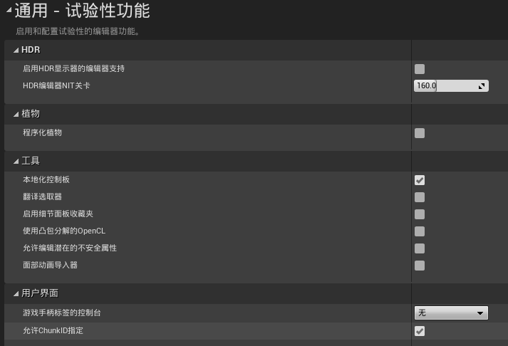

4. **Sound Cue と 2つの音声ファイル**を選択。  
5. 右クリック → 「アセット操作」→「チャンクに割り当て」を選択。

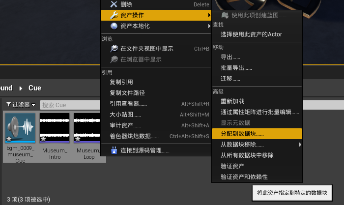

6. `チャンク ID` を 0 以外の数値に設定し、3つのアセットが同じ ID を持つようにします。

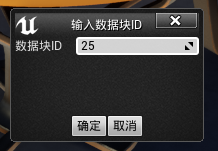

> 注意：`Sound_BGM` は 0 番チャンクに残しておきましょう。  
> 同じチャンクに入れるとゲームの全 BGM が再生されなくなる可能性があります。

> 「アセットを監査」から、どのチャンクに割り当てられたか確認できます。

## ステップ7：PAK にパッケージ化してゲームに配置

1. メニューの「ファイル」→「プロジェクトをパッケージ化」→「Windows (64-bit)」を選択。

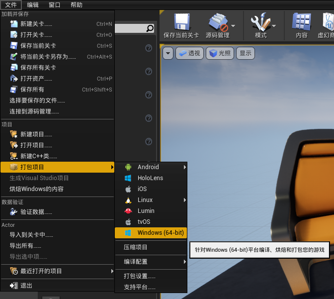

2. 出力先を選択（例：プロジェクトフォルダ）。初回は少し時間がかかります。

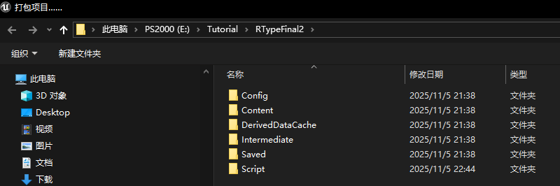

3. 出力先で `WindowsNoEditor\RTypeFinal2\Content\Paks` フォルダを開きます。  
4. `pakchunk{指定したID}-WindowsNoEditor.pak` が生成されています。  
   この中に `Sound Cue` と音声ファイルが含まれています。

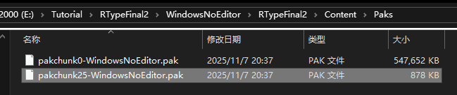

5. このファイルを `{任意の名前}_P.pak` にリネームします。  
   末尾の `_P` は**必須**です。

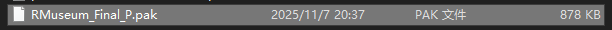

6. [PAKMod の導入方法](../../Chapter1_TheBasics/zhs/安装PAKMod.md) に従って、  
   ゲームディレクトリの `Paks` フォルダに配置します。

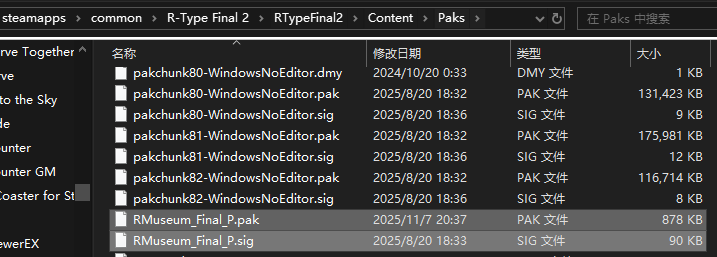

7. ゲームを起動して、BGM が正しく差し替えられているか確認しましょう。
